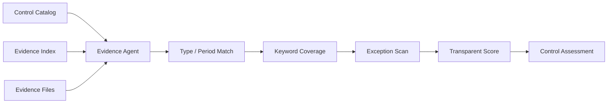

# Audit Evidence Agent

[](https://github.com/seoyeonglee/audit-evidence-agent/actions/workflows/tests.yml)

A deterministic audit-evidence review pipeline that maps evidence to controls, checks period and content coverage, highlights exception terms, and produces a transparent control-by-control assessment.

> All controls, evidence files, names, and scenarios are synthetic. This project does not contain employer workpapers, customer data, internal audit findings, or proprietary control logic.

## Why this project

Evidence collection is often repetitive before the real audit judgment begins. Reviewers need to answer basic questions such as:

- Did the requested evidence arrive?
- Is it the right type of evidence?
- Does it cover the target period?
- Does it discuss the expected control concepts?
- Does it contain obvious exception language?
- Which controls need human attention first?

This project automates that **pre-review organization layer** while keeping the scoring logic visible.

## Architecture



## Synthetic example

The checked-in audit package contains six controls and deliberately mixed evidence quality:

- quarterly privileged-access review — strong support
- production change sample — supported, but contains a remediation term
- backup restore test — strong support
- third-party review — partial because it is out of period and incomplete
- termination review — supported with an overdue exception noted
- security logging review — required evidence is missing

The output keeps both the score and the reasoning trail visible.

## Project structure

```text
audit-evidence-agent/
├── data/
│   ├── controls.csv
│   ├── evidence_index.csv
│   └── evidence/
│       ├── access_review_q3.txt
│       ├── backup_restore_test.txt
│       ├── change_ticket_sample.txt
│       ├── termination_review_q3.txt
│       └── vendor_review_q2.txt
├── docs/
│   ├── architecture.md
│   └── methodology.md
├── output/
│   ├── control_assessment.csv
│   └── summary.json
├── src/
│   ├── agent.py
│   ├── loaders.py
│   └── scoring.py
├── tests/
├── requirements.txt
└── README.md
```

## Run it

Windows:

```powershell
py -m venv .venv
.\.venv\Scripts\python.exe -m pip install -r requirements.txt
.\.venv\Scripts\python.exe src\agent.py
.\.venv\Scripts\python.exe -m pytest -q
```

macOS/Linux:

```bash
python -m venv .venv
source .venv/bin/activate
pip install -r requirements.txt
python src/agent.py
python -m pytest -q
```

## Assessment logic

The deterministic score considers:

- required evidence type
- target-period match
- control-specific keyword coverage
- explicit exception terms such as `overdue` or `pending remediation`

If the required evidence type does not exist, the control is marked `missing` rather than being matched to an unrelated document.

## Statuses

- **supported** — score >= 80
- **partial** — score 50–79
- **gap** — score < 50
- **missing** — required evidence type absent

## Why no LLM dependency?

The first version is intentionally deterministic. That makes the result reproducible, testable, and easy to audit.

A future LLM layer could add document summarization, date/owner extraction, contradiction detection, or draft workpaper language while retaining this layer as a validation guardrail.

## Important limitation

This tool does **not** issue audit opinions or determine control effectiveness. Evidence sufficiency, sampling, authenticity, design effectiveness, operating effectiveness, and final conclusions remain human audit responsibilities.

See [`docs/methodology.md`](docs/methodology.md).

## Tech

Python · Pandas · Audit Analytics · Evidence Review · Control Testing · Deterministic Agent
