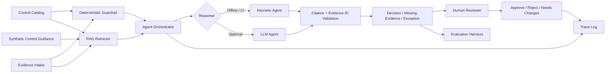

# Audit Evidence Agent

[](https://github.com/seoyeonglee/audit-evidence-agent/actions/workflows/tests.yml)

**AI-assisted audit evidence review with RAG, deterministic guardrails, human review, evaluation, and end-to-end traceability.**

This project models a realistic enterprise workflow: evidence is ingested, mapped to control requirements, retrieved into an agent context, evaluated for sufficiency and exceptions, validated for grounding, and routed to a human reviewer before any decision is finalized.

> All controls, evidence files, names, and scenarios are synthetic. This repository contains no employer workpapers, customer data, internal audit findings, proprietary control logic, or copyrighted control-standard text.

## What this demonstrates

- **Agentic workflow** — control interpretation, evidence validation, missing-evidence detection, and exception generation
- **RAG** — retrieval across control definitions, evidence documents, and synthetic control guidance
- **Grounded citations** — generated citations are checked against the exact retrieved context
- **Deterministic guardrails** — reproducible type/period/keyword/exception checks remain visible beside AI reasoning
- **Human-in-the-loop** — every AI result starts as pending and supports approve / reject / needs-changes feedback
- **Evaluation** — expected-output dataset with accuracy, precision, recall, false-positive, citation, grounding, and hallucination-proxy metrics
- **Traceability** — requirement → retrieved sources → baseline checks → AI result → validation → reviewer feedback

## Architecture



The local demo uses TF-IDF vectors so it runs deterministically without external infrastructure. The retrieval interface is deliberately designed so a production vector store such as **pgvector, Qdrant, Pinecone, or Elasticsearch/OpenSearch** can replace it.

## Agent workflow

For each control the agent:

1. reads the control requirement and expected evidence type;
2. runs deterministic evidence checks;
3. retrieves relevant control, evidence, and guidance chunks;
4. asks either the offline reasoner or optional LLM to produce a structured assessment;
5. validates citations against retrieved sources;
6. validates evidence IDs against the source index;
7. records missing evidence and explicit exceptions;
8. stores a trace of the complete decision path;
9. marks the result **pending human review**.

A high score cannot silently hide an explicit exception. Exception-bearing evidence is routed to human review as at least a `partial` result.

## RAG corpus

The demo indexes three source classes:

- `control:<control-id>` — control requirement and expected evidence
- `evidence:<evidence-id>` — synthetic submitted evidence
- `kb:<document>:<section>` — synthetic control-review guidance

The knowledge base intentionally describes generic review expectations instead of reproducing ISO, SOC 2, or other proprietary standard text.

## Human-in-the-loop

AI output is never treated as the final audit conclusion.

Reviewer events are append-only and support:

- `approve`
- `reject`
- `needs_changes`

Example:

```bash
python -m src.review \
  --run-id run-example \
  --control-id CH-01 \
  --decision needs_changes \
  --reviewer reviewer@example \
  --feedback "Confirm the open remediation item before sign-off."
```

The original model output remains intact so reviewer feedback can be analyzed separately.

## Evaluation

The checked-in synthetic dataset defines expected statuses for the demo controls.

Metrics include:

- exact status accuracy
- exception precision
- exception recall
- false-positive rate
- citation-valid rate
- grounded-result rate
- hallucination proxy rate

The hallucination proxy is intentionally conservative: a result is ungrounded if it references a citation that was not retrieved or an evidence ID that does not exist. It does **not** claim to detect every semantic hallucination.

## Run locally

### Install

```bash
python -m venv .venv
source .venv/bin/activate   # Windows: .venv\Scripts\activate
pip install -r requirements.txt
```

### 1. Deterministic baseline

```bash
python -m src.agent
```

Produces:

- `output/control_assessment.csv`
- `output/summary.json`

### 2. Agentic RAG review — offline

```bash
python -m src.agentic --provider heuristic
```

Produces:

- `output/agent_decisions.json`
- `output/trace.jsonl`

This mode is reproducible and used in CI.

### 3. Evaluate

```bash
python -m src.evaluate
```

Produces:

- `output/evaluation.json`

### 4. Optional LLM reasoning

Set an API key locally and run:

```bash
export OPENAI_API_KEY="..."
python -m src.agentic --provider openai
```

On Windows PowerShell:

```powershell
$env:OPENAI_API_KEY="..."
python -m src.agentic --provider openai
```

No API key is committed to the repository. The LLM receives only the synthetic retrieved context.

### 5. Tests

```bash
python -m pytest -q
```

## Example scenario

The synthetic package includes:

| Control | Scenario |
|---|---|
| AC-01 | privileged-access review with approval and revocation evidence |
| CH-01 | production change with an open remediation item |
| BC-01 | successful backup restoration test |
| TP-01 | vendor review that is out of period and still open |
| HR-01 | termination review containing an overdue revocation |
| LG-01 | required logging-review evidence is missing |

This mix makes the evaluation set cover supported, partial, exception-bearing, out-of-period, and missing-evidence paths.

## Project structure

```text
audit-evidence-agent/
├── data/
│   ├── controls.csv
│   ├── evidence_index.csv
│   ├── evidence/
│   └── knowledge_base/
├── eval/
│   └── expected_outputs.csv
├── docs/
│   ├── architecture.md
│   └── methodology.md
├── src/
│   ├── agent.py          # deterministic baseline
│   ├── agentic.py        # RAG + agent orchestration
│   ├── evaluate.py       # evaluation harness
│   ├── llm.py            # offline + optional LLM reasoners
│   ├── loaders.py
│   ├── retrieval.py
│   ├── review.py         # human feedback events
│   ├── schemas.py
│   ├── scoring.py
│   └── trace.py
├── tests/
├── requirements.txt
└── README.md
```

## Reliability principles

This project treats enterprise AI reliability as a system-design problem, not a prompt-only problem.

- deterministic checks remain available as guardrails
- source IDs are explicit and stable
- citations are allow-listed after generation
- missing evidence cannot be silently replaced by unrelated documents
- model decisions and reviewer actions are stored separately
- exception-bearing results require human attention
- synthetic expected outputs make regressions measurable

## Production extensions

A production version would add:

- document parsing and OCR pipelines
- embeddings + production vector database
- RBAC and tenant isolation
- encrypted evidence storage
- secrets management
- prompt/model/version lineage
- queue-based asynchronous processing
- reviewer UI and workflow state machine
- expert-labeled evaluation datasets
- adversarial and regression test suites
- privacy, retention, and deletion controls
- observability for latency, retrieval quality, token usage, and error rates

## Important limitation

This tool does **not** issue audit opinions, certify compliance, or determine control effectiveness. Evidence authenticity, population completeness, sampling, design effectiveness, operating effectiveness, and final audit conclusions remain human responsibilities.

See [architecture](docs/architecture.md) and [methodology](docs/methodology.md).

## Tech

Python · RAG · LLM APIs · TF-IDF Vector Retrieval · Structured Outputs · Human-in-the-Loop · Evaluation · Audit Analytics · Traceability
