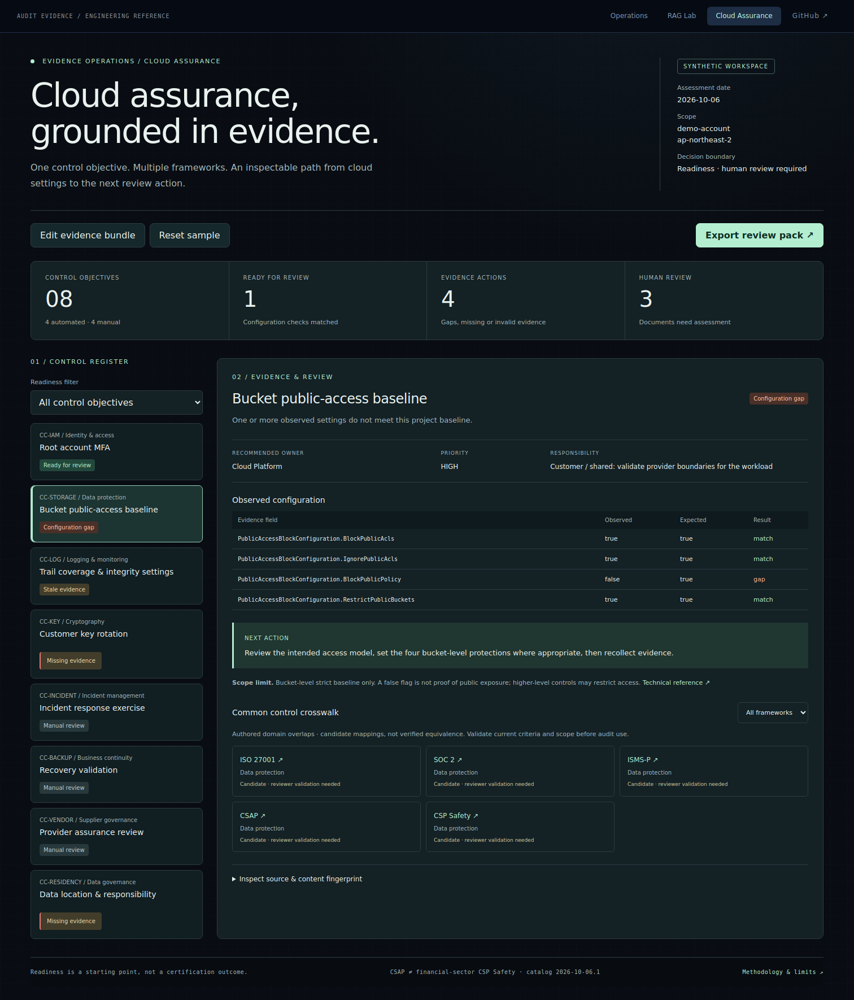
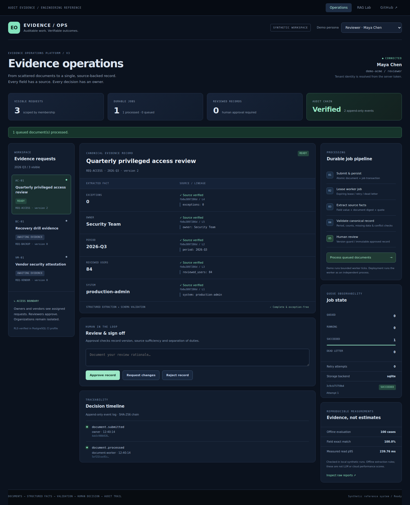
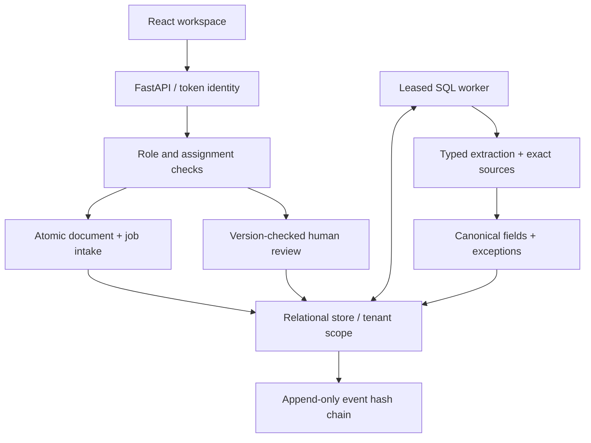
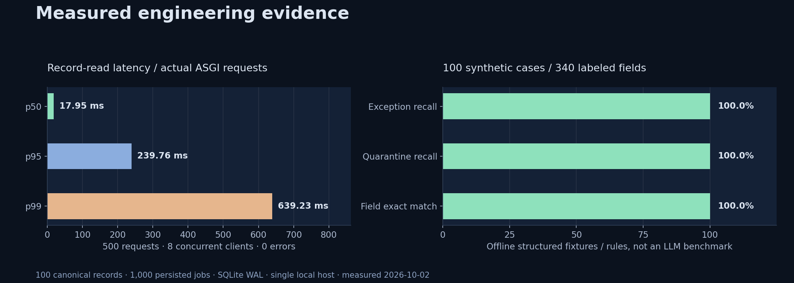

# Audit Evidence / Operations

[](https://github.com/seoyeonglee/audit-evidence-agent/actions/workflows/tests.yml)
[](https://seoyoung-audit-evidence.onrender.com)
[](https://seoyoung-audit-evidence-api.onrender.com/docs)

**Turn submitted documents into a source-backed evidence record, with durable processing and accountable human approval.**

An engineering reference project that makes its decisions inspectable: tenant boundaries in the database, retryable jobs, exact source lineage, immutable approvals, and tests that exercise failure and concurrency. The original retrieval and agent experiment remains available in **RAG Lab**.

**[Open workspace](https://seoyoung-audit-evidence.onrender.com)** · **[API reference](https://seoyoung-audit-evidence-api.onrender.com/docs)** · **[Verified CI run](https://github.com/seoyeonglee/audit-evidence-agent/actions/runs/36996099394)** · **[Implementation & review PR](https://github.com/seoyeonglee/audit-evidence-agent/pull/2)**

> All people, organizations, documents and controls are fictional. This repository demonstrates implemented engineering decisions; it does not claim real customer deployments, employer work, or historical team leadership. The public deployment explicitly runs the SQLite demo profile. PostgreSQL isolation is verified separately in CI.

## Cloud Assurance: reuse evidence across control objectives

The next step after evidence intake is understanding what the evidence actually supports. The **[Cloud Assurance workspace](https://seoyoung-audit-evidence.onrender.com/#cloud)** adds eight common control objectives, a versioned candidate domain crosswalk, four bounded AWS configuration checks, and an exportable review pack with source fingerprints and recommended next actions.

[](https://seoyoung-audit-evidence.onrender.com/#cloud)

- **Trace the result:** inspect expected versus observed settings, collection date, account/region scope, source metadata and SHA-256.
- **Explore a gap:** change a synthetic S3 flag, refresh a stale trail snapshot, or remove an evidence field; rerun to see the result change.
- **Prepare the review:** export owners, priorities, missing evidence and human review procedures. Suggested actions are not persisted tickets.
- **Keep the boundaries explicit:** ISO 27001, SOC 2, ISMS-P, CSAP and financial-sector CSP Safety links are authored **candidate domain overlaps**, not validated clause equivalence or certification coverage. CSAP and CSP Safety remain distinct.

The module uses synthetic normalized AWS-shaped data, makes no AWS calls, and requires no cloud credentials or spend. A matched setting means **ready for review**, never “certified.” [Methodology and primary sources](docs/cloud-assurance.md) · [Versioned catalog](data/cloud/catalog.json) · [Behavior tests](tests/test_cloud_assurance.py) · [Browser tests](frontend/tests/cloud-assurance.spec.ts).

Cloud extension verification: **68 backend tests passed**, **11 PostgreSQL tests skipped locally**, **5 browser scenarios passed**, and production build passed. [Verification record](docs/reports/cloud-assurance-verification.json). The historical measurements below retain their original scope.

## See the working system

[](https://seoyoung-audit-evidence.onrender.com)

*Actual Playwright capture after submitting and processing a document. Counts, fields, job states and audit events come from the API.*

| Inspect | What to look for |
|---|---|
| [Approved record](docs/screenshots/approved-record.png) | Reviewer feedback, locked approval and its append-only event |
| [External vendor view](docs/screenshots/vendor-scope.png) | Assigned request only; reviewer actions unavailable |
| [Mobile view](docs/screenshots/mobile.png) | Responsive layout checked against document overflow |
| [Browser test source](frontend/tests/operations.spec.ts) | Submission → processing → provenance inspection → approval; role and tenant boundaries |

The reviewer can inspect all requests in the synthetic organization. Switch to **Owner · Alex Rivera**, submit the sample for the access review, then switch to **Reviewer · Maya Chen**, process the queue, inspect sources and approve with feedback. **Vendor · Jordan Vale** sees the vendor request; **Other org reviewer · Nora Kim** sees a different tenant. Approved records cannot accept more submissions. The demo seeds a fixed request set and has no reset/supersession UI; use a fresh local database to repeat the complete scenario. Free Render services may need time to wake up and redeploys can reset demo data.

## Architecture with explicit boundaries



| Decision | Implemented behavior | Why / tradeoff |
|---|---|---|
| [Relational canonical record](docs/adr/001-relational-canonical-records.md) | Document values retain source IDs, digest, quote and line; conflicts block approval | Reviewers can trace facts rather than trust a summary |
| [Authorization + PostgreSQL RLS](docs/adr/002-authorization-and-rls.md) | Token-derived tenant, role/assignment checks, transaction-local DB context | Application checks and DB isolation; SQLite has application checks only |
| [Modular monolith](docs/adr/003-modular-monolith.md) | Separate intake, extraction, worker and review modules | Inspectable boundaries without a premature service fleet |
| [Transactional SQL queue](docs/adr/004-transactional-sql-queue.md) | Atomic intake, tenant-wide idempotency, SKIP LOCKED claims, leases, capped retry and dead letter | Avoid a dual-write gap; database contention remains a measured tradeoff |
| [Source facts + human review](docs/adr/005-source-facts-and-human-review.md) | Unsupported/missing/conflicting fields and open exceptions prevent approval | Explicit policy checks before a human decision |
| [Audit history](docs/adr/006-audit-history.md) | DB mutation triggers, per-request hash chain and verification endpoint | Tamper evidence within the stated trust boundary; no external anchoring |

Read the [architecture](docs/architecture.md), [domain model and invariants](docs/domain-model.md), [threat model](THREAT_MODEL.md), and [AI pipeline boundaries](docs/ai-pipeline.md).

## Tested behavior, including failure paths

| Check | Observed result | Reproduce / evidence |
|---|---|---|
| Python behavior suite | **59 passed**, 11 PostgreSQL tests skipped locally | `python -m pytest -q`; [coverage summary](docs/reports/coverage-summary.json) |
| Real PostgreSQL 16 integration | **11 passed** in GitHub Actions | [CI run](https://github.com/seoyeonglee/audit-evidence-agent/actions/runs/36996099394); [tests](tests/platform/test_postgres.py) |
| Chromium end-to-end workflows | **3 passed** | [browser report](docs/reports/browser-tests.json), screenshots and CI artifacts |
| TypeScript + production frontend | **Build passed** | `npm run build` runs TypeScript before Vite |
| New Python modules | **Lint and format checks passed** | Ruff checks in the backend CI job |

The PostgreSQL tests use a runtime role that is neither superuser nor BYPASSRLS. They issue unfiltered SQL, attempt cross-tenant inserts, recycle pooled connections, race duplicate submissions, coordinate stale-worker/lease recovery, and attempt audit-event mutation. Queue tests cover retry exhaustion, final-attempt crashes, fencing stale workers and approval invalidation after a failed additional document. API tests reject forged role/tenant inputs and keep demo endpoints absent unless explicitly enabled.

The review found and corrected idempotency locking, lock-order inversion, invalid calendar dates, inaccurate JSON source locations and an unsafe demo default. CI also caught a real PostgreSQL migration placeholder bug. [Findings and regression evidence](docs/review-findings.md) · [Bootstrap concurrency incident](docs/postmortems/001-concurrent-demo-bootstrap.md) · [Migration incident](docs/postmortems/002-postgres-migration-placeholder.md).

## Measurements you can reproduce



| Measurement | Result | Conditions |
|---|---:|---|
| Record-read p50 / p95 / p99 | **17.95 / 239.76 / 639.23 ms** | 500 in-process ASGI reads, concurrency 8, SQLite WAL, token lookup included |
| Read errors | **0 / 500** | One local host; no network/TLS/cloud load generator |
| Persisted processing workload | **1,000 jobs / 100 records completed** | 10 documents per record; single deterministic worker |
| Processing elapsed time | **3.35 s** | Structured key-value fixtures; no OCR or external model calls |
| Offline field exact match | **340 / 340** | 100 authored synthetic text/CSV/JSON cases |
| Unsupported field rate | **0%** | Bounded labeled corpus; not a general-document accuracy claim |

[Raw latencies and environment](docs/reports/benchmark.json) · [Per-case evaluation results](docs/reports/evaluation.json) · [Evaluation corpus](eval/platform-corpus.json) · [Benchmark script](scripts/benchmark.py).

The tail latency is material: SQLite transactions serialize and p99 is much slower than p50. This result motivates the [scaling plan](docs/scaling-strategy.md); it is not a production SLO. The 100% extraction result describes deliberately bounded structured fixtures, not LLM quality, scanned PDFs or real audit-document performance.

## Run locally

Python 3.12 and Node 20 are the CI reference environment.

```bash
python -m venv .venv
source .venv/bin/activate
pip install -r requirements-dev.txt
DEMO_MODE=1 DATABASE_URL=sqlite:///evidence-platform.db \
  uvicorn src.api:app --host 127.0.0.1 --port 8000
```

In a second terminal:

```bash
cd frontend
npm ci
npm run dev -- --host 127.0.0.1
```

Open `http://localhost:5173`. The demo's **Process queued documents** button executes bounded worker ticks. To exercise the worker as a separate process after the demo has bootstrapped:

```bash
DATABASE_URL=sqlite:///evidence-platform.db \
  python -m src.platform.worker --tenant demo-acme
```

Verify and regenerate measurements:

```bash
python -m pytest -q
ruff check --select F src/platform scripts/benchmark.py scripts/evaluate_platform.py scripts/render_reports.py tests/platform
ruff format --check src/platform scripts/benchmark.py scripts/evaluate_platform.py scripts/render_reports.py tests/platform
python -m scripts.evaluate_platform
python -m scripts.benchmark
cd frontend
npm run build
npx playwright install chromium
npx playwright test
```

Use a fresh SQLite file for each complete browser run: `E2E_DATABASE_URL=sqlite:///my-fresh-e2e.db npx playwright test`. Set `PYTHON_BIN` to the virtualenv Python when it is not activated. Matplotlib is optional for `scripts/render_reports.py`; measurement generation itself does not require it. PostgreSQL tests run with `TEST_POSTGRES_URL` against an **isolated disposable database**, because they install schema/policies and a test runtime role.

## Operating the next version

| Area | Concrete artifact |
|---|---|
| Change ownership and release gates | [Engineering playbook](ENGINEERING_PLAYBOOK.md) |
| Queue failure and recovery | [Recovery runbook](docs/runbooks/queue-recovery.md) |
| Release, rollback and restore | [Release runbook](docs/runbooks/release-and-restore.md) |
| What is measured today | [Observability](docs/observability.md) |
| Capacity and external-queue decision | [Scaling strategy](docs/scaling-strategy.md) |
| Cost model with explicit assumptions | [Cost model](docs/cost-model.md) |
| Prioritized next 90 days | [Ownership plan](docs/ownership-90-days.md) |
| Original retrieval and agent demo | [RAG Lab documentation](docs/legacy-rag.md) |

These are design and operating artifacts for this reference project, not claims of a production on-call history. Before private deployment: provision PostgreSQL with separate migration/runtime credentials, integrate SSO and membership provisioning, supply persistent document storage and retention controls, test backups, and validate a representative document corpus. Current intake accepts normalized text/CSV/JSON; PDF normalization is a separate helper, without a binary upload UI or OCR. Production token issuance and login UI, source supersession and external audit anchoring remain explicit next steps.
