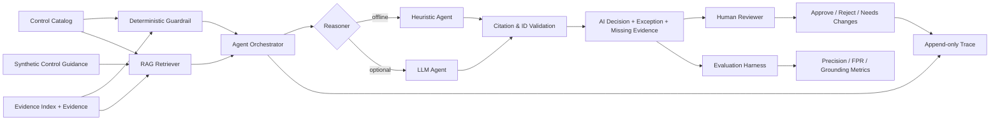

# Architecture

The project uses a layered design: deterministic validation remains the
guardrail, while retrieval and an optional LLM add semantic reasoning. Human
review stays outside the model decision.

## Design choices

### Deterministic guardrail
The original scorer checks evidence type, target period, keyword coverage, and
explicit exception terms. It is intentionally retained so semantic reasoning
does not erase reproducible checks.

### Retrieval layer
Controls, evidence, and synthetic control guidance are indexed behind a
top-k retrieval interface. The repository uses local TF-IDF vectors to remain
fully runnable without infrastructure. The interface is intentionally close to
a production vector-store workflow so it can be swapped for pgvector, Qdrant,
Pinecone, or another store.

### Agent reasoning
Two providers are supported:
- `heuristic`: deterministic, offline, and used in CI.
- `openai`: optional LLM reasoning over only the retrieved context.

The LLM is instructed to return structured JSON and is not trusted blindly.
Every citation and evidence ID is validated after generation.

### Human-in-the-loop
Agent decisions are created with `review_status=pending`. Reviewer actions
are stored as append-only events so approval does not overwrite the original
model output.

### Traceability
Each run records the control, query, retrieved sources and scores,
deterministic baseline, agent output, citation validation, and grounding
result. This creates an inspectable lineage from requirement to evidence to
decision.

### Evaluation
The checked-in synthetic expected-output set measures status accuracy,
exception precision/recall, false-positive rate, citation validity,
grounding rate, and a conservative hallucination proxy.
