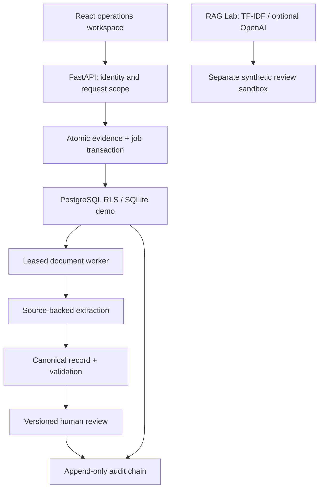

# Evidence Operations architecture

The core problem is reconciling fragmented evidence and stakeholder decisions into one auditable record. This repository separates the domain workflow from probabilistic reasoning: v2 persists records and authorizes transitions; v1 demonstrates retrieval and optional LLM assessment.

## Component boundaries

| Module | Responsibility | Contract |
|---|---|---|
| `auth.py` | Immutable authenticated tenant membership | `Principal` |
| `database.py` | Transactions, schema bootstrap, tenant context | `Store.transaction(tenant_id)` |
| `service.py` | Intake, scope, review/version rules, audit verification | `EvidenceService` |
| `extraction.py` | Exact structured facts and source spans | `extract(document)` / `canonical_record()` |
| `worker.py` | Job claim, lease fencing, retry and finalization | `Worker.claim/complete/fail/tick` |
| `routes.py` | Typed HTTP boundaries and explicit demo enablement | `/api/v2/*` |
| `src/retrieval.py`, `src/llm.py` | Existing RAG and reasoning interfaces | v1 demonstration, separate from v2 facts |
| `frontend/src/operations` | Persona-scoped workspace and observable results | Typed v2 API calls |

A document request is accepted before analysis finishes. Document, job, request version and submission event commit together. Worker extraction happens outside a database transaction. Finalization locks the job before its request, rechecks the lease token, persists extraction, recomputes the canonical record and appends the event together. Approved records cannot be changed through either service submission or worker completion.

## Storage profiles

PostgreSQL is the integration/deployment profile. Runtime connections use a role that is neither table owner, superuser nor BYPASSRLS. `set_config(..., true)` scopes tenant context to a transaction; missing context yields no evidence rows. Queue selection uses SKIP LOCKED. Tenant-wide idempotency uses a transaction-scoped advisory lock keyed by tenant and supplied key.

SQLite is the zero-service synthetic demo. WAL and BEGIN IMMEDIATE serialize transactions across processes. It validates the same application behavior but cannot prove RLS or PostgreSQL performance. Public free-tier hosting has an ephemeral filesystem: the demo survives API object/reconnection changes but not every platform redeploy. Use managed PostgreSQL or a persistent volume for retention guarantees.

## Delivery and deployment boundary

The actual public demo consists of the existing Render static frontend and one Python service. DEMO_MODE=1 exposes fictional personas and bounded manual worker ticks; it must never contain private data. A deployment with DEMO_MODE=0 uses provisioned tokens and a separately running worker. The production UI does not yet offer SSO/login.

S3/SQS/OCR/managed LLM are future adapters, not infrastructure claimed to be running. Start with transactionally correct SQL processing, then move binary blobs to an object-store adapter and add an outbox only if external queue throughput warrants the extra failure modes.
