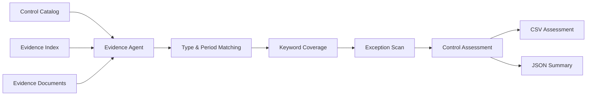

# Architecture

## Components

- **Control catalog** defines the requirement, expected evidence type, target period, and review keywords.
- **Evidence index** provides metadata about each evidence item.
- **Loader** reads the indexed text evidence.
- **Scoring layer** evaluates evidence type, period, keyword coverage, and explicit exception terms.
- **Agent orchestration** selects the strongest matching evidence and produces a review-ready assessment with a visible reasoning trail.

The implementation is deterministic so the same inputs produce the same assessment.
