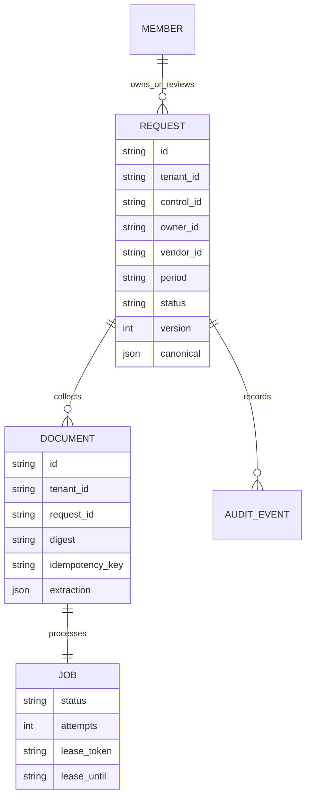

# Domain model and invariants

Composite tenant/request and tenant/document foreign keys prevent a document or job from referencing another tenant's entity. Request IDs are globally unique; idempotency keys are unique within a tenant. Authentication membership rows are read before tenant context is available, contain only token hashes and identity metadata, and are not exposed through an enumeration API.

A canonical record has `fields`, each with a value and source document ID/digest/line/quote; `candidates` retains supporting values across documents; `exceptions` records missing facts, period mismatch, conflicting values and reported exceptions. Completeness is a conservative rule result, never a final audit opinion.

Request states are awaiting_evidence → processing → ready → approved / rejected / needs_changes. Approval is irreversible in this reference workflow. Rejected/needs_changes records accept additional source submissions, but original conflicting or dead sources cannot yet be superseded. Their unresolved exceptions continue to block approval. This limitation is preferable to erasing contradictory evidence. A production correction mechanism must explicitly link replacement documents and reviewer authorization.

Job states are queued → running → succeeded, or running → queued with exponential backoff, or running → dead_letter. An expired running lease can be reclaimed with a new token. Exhaustion after a worker crash is terminalized on a subsequent claim. Every finalizer compares the token and current lease expiry; old workers cannot write over reclaimed jobs.

Review requires reviewer role, completed processing, matching record version, independent submitter and no unresolved exceptions. All history mutations append events. The hash chain is per request so locking one request serializes its chain without globally serializing every tenant event.
